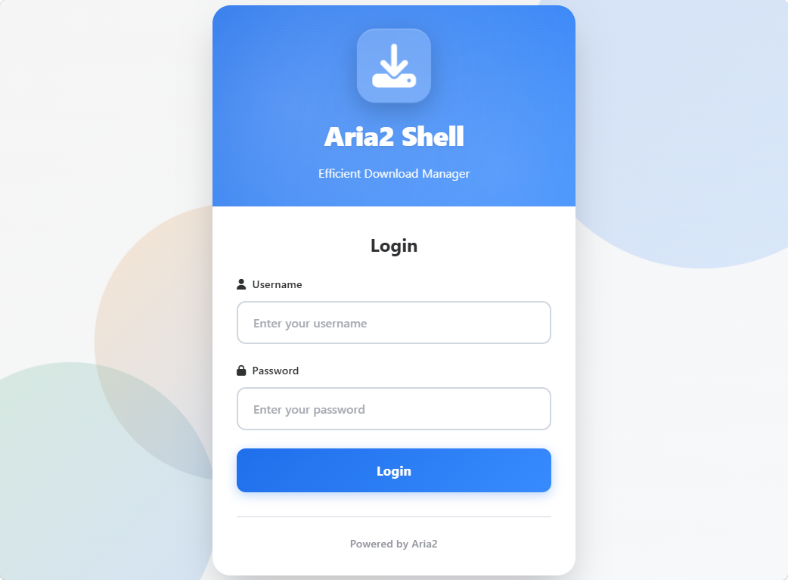
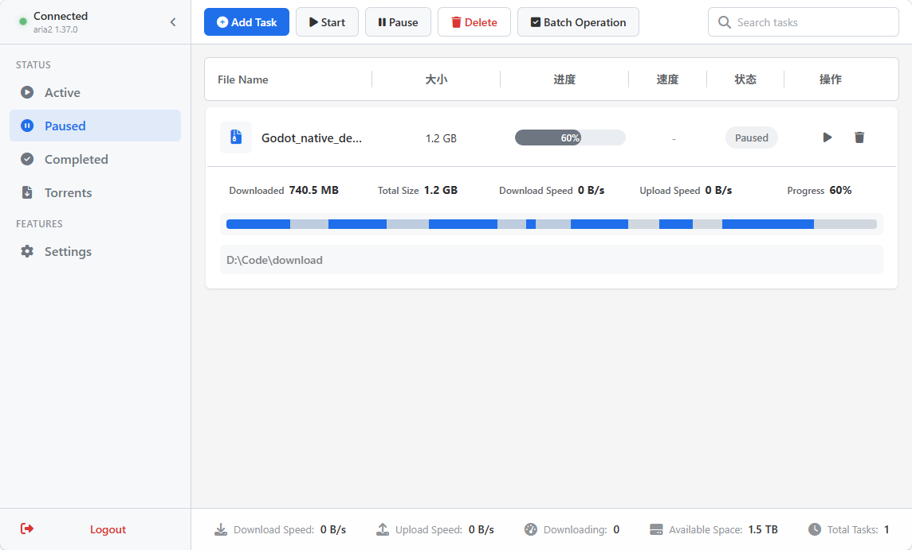
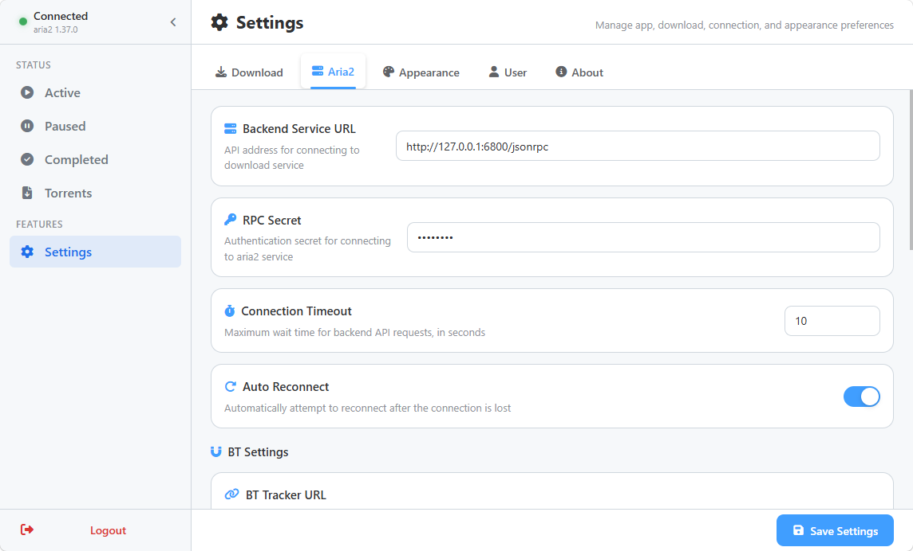

# aria2-shell - Aria2 Download Manager

**阅读其他语言版本: [中文](README.md)**

A modern Aria2 download manager with a complete Web UI and backend API, supporting task management, user authentication, proxy configuration, multi-threaded downloading, BT seeding, and more.

## Screenshots

### Login Page


### Task List


### Settings Page


## Project Structure

```
aria2-shell/
├── web/              # Frontend Vue3 + Vite project
├── server/           # Backend Fastify + TypeScript server
└── .env              # Environment variables configuration
```

## Features

✨ **Download Management**
- Complete task categorization (Active, Waiting, Paused, Completed, Seeding, Error)
- Add, pause, resume, delete tasks
- Support deleting local files when removing tasks
- Batch operations (batch pause, start, delete)
- Real-time speed and progress display
- Piece progress visualization (continuous progress bar highlighting downloaded pieces)
- Multi-threaded download support (configurable 1-16 threads)
- Global download/upload speed limits
- Support HTTP(S)/FTP/Magnet links and torrent file uploads
- Virtual scrolling optimization for smooth display of thousands of tasks
- Smart search (supports filename/GID/path search with debounce)

🎯 **BT/Torrent Support**
- BT torrent file upload
- Magnet link support
- Continue seeding after download completion
- Configurable minimum seed ratio and seed time
- Custom Tracker server list
- BT upload speed limit
- Torrent file list display

🌐 **Proxy Support**
- HTTP/HTTPS/SOCKS5 proxy configuration
- Proxy authentication support (username/password)
- Custom proxy test server address
- One-click proxy connection testing

🎨 **UI/UX Design**
- Built with Vue3 + TypeScript + Vite
- Responsive layout, adapts to desktop and mobile
- Dark/Light/System theme switching
- Internationalization support (Chinese/English)
- FontAwesome icon library
- Real-time dashboard statistics (download/upload speed, task count, disk space)
- Customizable browser tab title

🔐 **User Authentication**
- User registration and login
- JWT Token authentication
- Persistent user settings
- Password change functionality
- Configurable registration button visibility

⚙️ **Rich Settings**
- Download settings (max concurrent tasks, speed limits, thread count, default save path, multiple save locations)
- Aria2 connection configuration (RPC URL, secret, auto-reconnect, timeout)
- Proxy settings (HTTP/HTTPS/SOCKS5)
- BT settings (seeding configuration, Trackers)
- Appearance settings (theme, language, page title)
- User account management (password change)

📁 **Filesystem Browsing**
- Tree filesystem browser
- Directory navigation
- Path selection functionality
- New folder creation
- Automatically detect disk of default download path and show available space

## Quick Start

### Requirements
- Node.js >= 20 (Node.js 24 LTS recommended)
- npm >= 9 or pnpm >= 9
- Aria2 service (needs to be started in advance)

### Environment Variables

Create a `.env` file in the project root:

```env
# Server
PORT=65002
NODE_ENV=development
ENABLE_REGISTER=true

# Aria2
ARIA2_RPC_URL=http://localhost:6800/jsonrpc
ARIA2_RPC_SECRET=
ARIA2_SECRET=

# Security
JWT_SECRET=your-secret-key-change-in-production
JWT_EXPIRES_IN=7d

# Data
DATA_DIR=./data
```

**Environment Variables Description:**
- `PORT` - Backend service port, default 65002
- `NODE_ENV` - Runtime environment (development/production)
- `ENABLE_REGISTER` - Enable user registration, default true
- `ARIA2_RPC_URL` - Aria2 RPC service address
- `ARIA2_SECRET` / `ARIA2_RPC_SECRET` - Aria2 RPC secret
- `JWT_SECRET` - JWT encryption key, change this in production
- `JWT_EXPIRES_IN` - JWT expiration time, default 7 days
- `DATA_DIR` - Data storage directory, default ./data

### Start Backend Server

```bash
cd server
npm install
npm run dev
```

Backend API runs at `http://localhost:65002`

#### CLI Tools

The backend provides CLI tools for user management:

```bash
# Register new user
npm run cli:register

# List all users
npm run cli:list

# Show user details
npm run cli:show <username>
```

### Start Web Development Server

```bash
cd web
npm install
npm run dev
```

Web UI runs at `http://localhost:5173`

## API Endpoints

### Authentication
- `POST /api/auth/login` - User login
- `POST /api/auth/register` - User registration
- `POST /api/auth/change-password` - Change password

### User Configuration
- `GET /api/user/configs` - Get all configurations
- `POST /api/user/config` - Update single configuration
- `POST /api/user/reset-configs` - Reset all configurations

### Aria2
- `POST /api/aria2/call` - Direct Aria2 RPC call
- `POST /api/aria2/add-uri` - Add URI download
- `GET /api/aria2/status/:gid` - Get task status
- `GET /api/aria2/active` - Get active tasks
- `GET /api/aria2/waiting` - Get waiting tasks
- `GET /api/aria2/stopped` - Get stopped tasks
- `GET /api/aria2/all-lists` - Get all lists in one request (reduces request count)
- `GET /api/aria2/dashboard` - Get dashboard statistics (connection status + global speed + disk space)
- `POST /api/aria2/pause/:gid` - Pause task
- `POST /api/aria2/unpause/:gid` - Resume task
- `DELETE /api/aria2/remove/:gid` - Remove task
- `DELETE /api/aria2/force-remove/:gid` - Force remove task
- `DELETE /api/aria2/remove-result/:gid` - Remove completed task record
- `GET /api/aria2/global-stat` - Get global statistics
- `GET /api/aria2/version` - Get Aria2 version

### Filesystem
- `GET /api/filesystem/list` - Get directory structure
- `GET /api/filesystem/disk-space` - Get disk space information

### Proxy
- `POST /api/proxy/test` - Test proxy connection

## Build and Deployment

### GitHub Actions Build

The project is configured with GitHub Actions workflow that automatically builds when:

- Pushing to `main` or `master` branch
- Pushing `v*` tags (creates Release simultaneously)
- Pull Requests
- Manual trigger

Build produces three archives:
- `aria2-server.zip` - Backend service package
- `aria2-web.zip` - Frontend static files package
- `aria2-full.zip` - Complete package

### Backend Build

```bash
cd server
npm run build
npm start
```

### Frontend Build

```bash
cd web
npm run build
```

Generated files are in `web/dist/` directory, can be deployed to any static web server.

### Deployment Steps

1. Extract `aria2-server.zip` to server directory
2. Copy `.env.example` to `.env` and configure
3. Run `npm install && npm start`
4. Extract `aria2-web.zip` and deploy to web server (Nginx, Apache, etc.)

## Configure Aria2

Make sure Aria2 is started with RPC enabled:

```bash
aria2c --enable-rpc --rpc-listen-all --rpc-secret=your_secret
```

Update `ARIA2_RPC_URL` and `ARIA2_RPC_SECRET` in `.env` file.

## Performance Optimizations

- **Smart Request Strategy**: Active page refreshes every 1 second, Torrents page refreshes every 1 second, Paused/Completed pages only refresh after operations
- **Batch API**: Torrents page uses `/all-lists` endpoint to fetch all data in one request, reducing HTTP requests
- **Background Cache Warmup**: When refreshing active page, approximately every 5 seconds does a full sync of all list caches, switching pages needs no waiting
- **Virtual Scrolling**: Only renders visible area DOM even with tens of thousands of tasks, smooth scrolling
- **Search Debounce**: 200ms debounce on search input, avoids frequent calculations
- **Preprocessed Indexes**: Builds search indexes when data loads, no repeated conversion during search
- **Binary Search Positioning**: Virtual scrolling uses binary search to find starting item, time complexity O(log n)
- **Shallow Watch**: Removed deep watch, only watches array reference changes, significantly reduces Vue reactivity overhead

## FAQ

**Q: Port already in use error on startup**
A: Modify `PORT` configuration in `.env` file

**Q: Aria2 connection failed**
A: Ensure Aria2 RPC service is running, check connection configuration in `.env`, verify RPC secret is correct

**Q: How to reset all settings**
A: Click "Reset to Default" in the "About" tab of settings panel

**Q: How to add new languages**
A: Add new language file in `web/src/i18n/locales/`, and register it in `web/src/i18n/index.ts`

**Q: How to disable registration**
A: Set `ENABLE_REGISTER=false` in `.env`, the register button will be hidden on login page

**Q: Proxy connection test fails**
A: Check proxy address format (supports http://, https://, socks5://), confirm proxy service is running, check firewall settings

**Q: How to delete local files when deleting tasks**
A: Check "Also delete local files" option when deleting tasks

**Q: How to stop seeding after BT download completes**
A: Disable "Keep Seeding After Completion" in Settings -> Download, or configure "Minimum Seed Ratio" and "Minimum Seed Time"

**Q: How to configure multi-threaded downloading**
A: Adjust "Download Threads" in Settings -> Download, default 5 threads, maximum 16 threads supported

## License

MIT

## Contributing

Issues and Pull Requests are welcome!