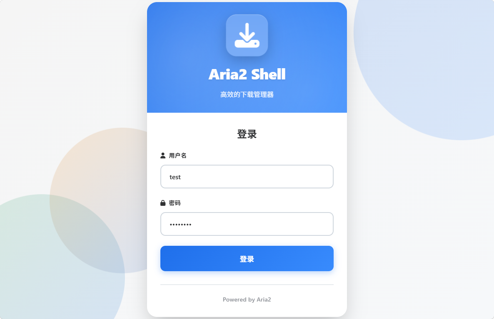
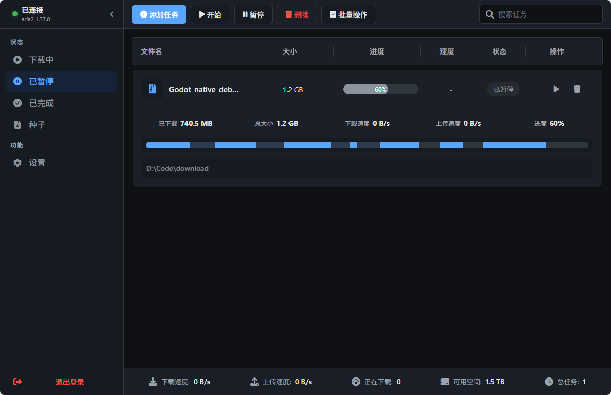
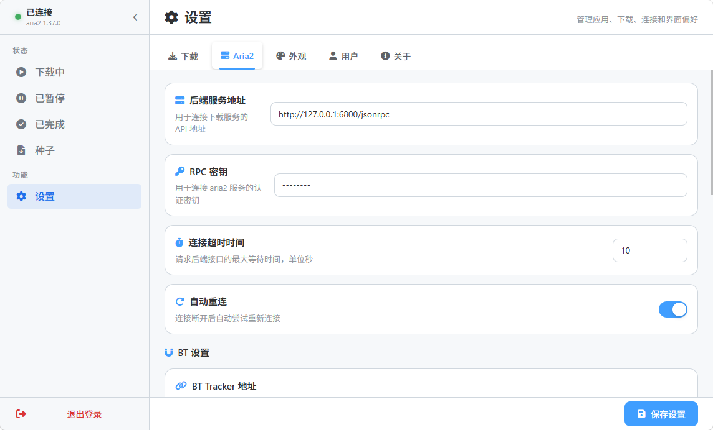

# aria2-shell - Aria2 下载管理器

**Read this in other languages: [English](README.en.md)**

一个现代化的 Aria2 下载管理器，包含完整的 Web UI 和后端 API，支持任务管理、用户认证、代理配置、多线程下载、BT 做种等功能。

## 界面预览

### 登录页面


### 任务列表


### 设置页面


## 项目架构

```
aria2-shell/
├── web/              # 前端 Vue3 + Vite 项目
├── server/           # 后端 Fastify + TypeScript 服务器
└── .env              # 环境变量配置
```

## 核心特性

✨ **下载管理**
- 完整的任务分类（下载中、等待、已暂停、已完成、做种中、错误）
- 添加、暂停、恢复、删除任务
- 支持删除任务同时删除本地文件
- 批量操作（批量暂停、开始、删除）
- 实时速度和进度显示
- 分片进度可视化（连续进度条高亮已下载分片）
- 多线程下载支持（可配置 1-16 线程）
- 全局下载/上传速度限制
- 支持 HTTP(S)/FTP/Magnet 链接及种子文件上传
- 虚拟滚动优化，支持上万任务流畅展示
- 智能搜索（支持文件名/GID/保存路径搜索，带防抖）

🎯 **BT/种子支持**
- BT 种子文件上传
- Magnet 磁力链接支持
- 下载完成后继续做种
- 可配置最小分享率和做种时间
- 自定义 Tracker 服务器列表
- BT 上传速度限制
- 种子内文件列表展示

🌐 **代理支持**
- HTTP/HTTPS/SOCKS5 代理配置
- 代理认证支持（用户名/密码）
- 自定义代理测试服务器地址
- 一键测试代理连接是否正常

🎨 **UI/UX 设计**
- Vue3 + TypeScript + Vite 构建
- 响应式布局，适配桌面端和移动端
- 深色/浅色/跟随系统主题切换
- 国际化支持（中文/英文）
- FontAwesome 图标库
- 实时仪表盘统计（下载/上传速度、任务数量、磁盘空间）
- 自定义浏览器标签页标题

🔐 **用户认证**
- 用户注册和登录
- JWT Token 认证
- 用户设置持久化
- 密码修改功能
- 可配置是否显示注册入口

⚙️ **丰富的设置**
- 下载设置（最大任务数、速度限制、多线程数、默认保存路径、多个保存位置）
- Aria2 连接配置（RPC地址、密钥、自动重连、超时设置）
- 代理设置（HTTP/HTTPS/SOCKS5）
- BT 设置（做种配置、Tracker）
- 外观设置（主题、语言、网页名称）
- 用户账户管理（修改密码）

📁 **文件系统浏览**
- 树状文件系统浏览
- 目录导航
- 路径选择功能
- 新建文件夹功能
- 自动识别默认下载路径所在磁盘，显示可用空间

## 快速开始

### 环境要求
- Node.js >= 20 (推荐使用 Node.js 24 LTS)
- npm >= 9 或 pnpm >= 9
- Aria2 服务（需预先启动）

### 配置环境变量

在项目根目录创建 `.env` 文件：

```env
# Server
PORT=65002
NODE_ENV=development
ENABLE_REGISTER=true

# Aria2
ARIA2_RPC_URL=http://localhost:6800/jsonrpc
ARIA2_RPC_SECRET=
ARIA2_SECRET=

# Security
JWT_SECRET=your-secret-key-change-in-production
JWT_EXPIRES_IN=7d

# Data
DATA_DIR=./data
```

**环境变量说明：**
- `PORT` - 后端服务端口，默认 65002
- `NODE_ENV` - 运行环境 (development/production)
- `ENABLE_REGISTER` - 是否启用用户注册功能，默认 true
- `ARIA2_RPC_URL` - Aria2 RPC 服务地址
- `ARIA2_SECRET` / `ARIA2_RPC_SECRET` - Aria2 RPC 密钥
- `JWT_SECRET` - JWT 加密密钥，生产环境务必修改
- `JWT_EXPIRES_IN` - JWT 过期时间，默认 7 天
- `DATA_DIR` - 数据存储目录，默认 ./data

### 启动后端服务器

```bash
cd server
npm install
npm run dev
```

后端 API 运行在 `http://localhost:65002`

#### CLI 工具

后端提供 CLI 命令行工具用于用户管理：

```bash
# 注册新用户
npm run cli:register

# 列出所有用户
npm run cli:list

# 查看用户详情
npm run cli:show <username>
```

### 启动 Web 开发服务器

```bash
cd web
npm install
npm run dev
```

Web UI 运行在 `http://localhost:5173`

## 项目结构详解

### Web 项目 (`web/`)

```
web/
├── src/
│   ├── components/          # Vue 组件库
│   │   ├── common/          # 通用控件组件
│   │   │   ├── CustomSelect.vue
│   │   │   ├── NumberControl.vue
│   │   │   ├── SelectControl.vue
│   │   │   ├── SwitchControl.vue
│   │   │   ├── TextControl.vue
│   │   │   └── TextareaControl.vue
│   │   ├── dialogs/         # 对话框组件
│   │   │   ├── AddTaskDialog.vue       # 添加任务对话框
│   │   │   ├── ConfirmDialog.vue       # 确认对话框
│   │   │   └── FileSelectorDialog.vue  # 文件选择对话框
│   │   ├── layout/          # 布局组件
│   │   │   └── Sidebar.vue             # 侧边栏
│   │   ├── settings/        # 设置相关组件
│   │   │   ├── AboutTab.vue
│   │   │   ├── AppearanceTab.vue
│   │   │   ├── Aria2Tab.vue
│   │   │   ├── DownloadTab.vue
│   │   │   ├── SettingItem.vue
│   │   │   ├── SettingsPanel.vue
│   │   │   └── UserTab.vue
│   │   └── task/            # 任务相关组件
│   │       ├── TaskFooter.vue          # 底部统计
│   │       ├── TaskItem.vue            # 任务项
│   │       ├── TaskList.vue            # 任务列表（虚拟滚动）
│   │       ├── TaskProgressBar.vue     # 进度条
│   │       └── TaskToolbar.vue         # 任务工具栏
│   ├── views/               # 页面组件
│   │   ├── LoginPage.vue
│   │   ├── SettingsPage.vue
│   │   ├── TaskListView.vue  # 任务列表视图（下载中/已完成/已暂停/种子）
│   │   └── TaskPage.vue
│   ├── services/            # 业务服务
│   │   ├── aria2.ts         # Aria2 API 服务
│   │   ├── auth.ts          # 认证服务
│   │   ├── settings.ts      # 设置服务
│   │   ├── theme.ts         # 主题服务
│   │   └── title.ts         # 标题服务
│   ├── stores/              # Pinia 状态管理
│   │   ├── connectionStore.ts
│   │   ├── dashboardStore.ts
│   │   └── taskStore.ts
│   ├── i18n/                # 国际化
│   │   ├── index.ts
│   │   └── locales/
│   │       ├── zh-CN.ts
│   │       └── en-US.ts
│   ├── config/              # 配置
│   │   └── api.ts
│   ├── types/               # TypeScript 类型定义
│   │   ├── components.ts
│   │   ├── env.d.ts
│   │   └── settings.ts
│   ├── styles/              # 全局样式
│   │   └── main.css
│   ├── router/              # 路由
│   │   └── index.ts
│   ├── App.vue              # 根组件
│   └── main.ts              # 应用入口
├── vite.config.ts           # Vite 配置
├── tsconfig.json            # TypeScript 配置
└── package.json
```

### Server 项目 (`server/`)

```
server/
├── src/
│   ├── server.ts            # Fastify 服务器入口
│   ├── cli.ts               # CLI 启动入口
│   ├── routes/              # API 路由
│   │   ├── auth.ts          # 认证路由（登录/注册/修改密码）
│   │   ├── user.ts          # 用户路由（配置管理）
│   │   ├── aria2.ts         # Aria2 代理路由
│   │   ├── filesystem.ts    # 文件系统路由
│   │   └── proxy.ts         # 代理测试路由
│   ├── aria2Client.ts       # Aria2 RPC 客户端
│   ├── aria2Connection.ts   # Aria2 连接管理
│   ├── aria2Manager.ts      # Aria2 任务管理
│   ├── store.ts             # 数据存储
│   ├── userService.ts       # 用户服务
│   ├── utils.ts             # 工具函数
│   └── types/               # 类型定义
│       └── user.d.ts
├── data/                    # 数据目录
│   └── store.json
├── dist/                    # 编译输出
├── tsconfig.json            # TypeScript 配置
├── tsup.config.ts           # TSUP 打包配置
└── package.json
```

## API 端点

### 认证
- `POST /api/auth/login` - 用户登录
- `POST /api/auth/register` - 用户注册
- `POST /api/auth/change-password` - 修改密码

### 用户配置
- `GET /api/user/configs` - 获取所有配置
- `POST /api/user/config` - 更新单个配置
- `POST /api/user/reset-configs` - 重置所有配置

### Aria2
- `POST /api/aria2/call` - 直接调用 Aria2 RPC
- `POST /api/aria2/add-uri` - 添加 URI 下载
- `GET /api/aria2/status/:gid` - 获取任务状态
- `GET /api/aria2/active` - 获取活跃任务
- `GET /api/aria2/waiting` - 获取等待任务
- `GET /api/aria2/stopped` - 获取已停止任务
- `GET /api/aria2/all-lists` - 一次性获取所有列表（减少请求次数）
- `GET /api/aria2/dashboard` - 获取仪表盘统计数据（连接状态+全局速度+磁盘空间）
- `POST /api/aria2/pause/:gid` - 暂停任务
- `POST /api/aria2/unpause/:gid` - 恢复任务
- `DELETE /api/aria2/remove/:gid` - 删除任务
- `DELETE /api/aria2/force-remove/:gid` - 强制删除任务
- `DELETE /api/aria2/remove-result/:gid` - 删除已完成任务记录
- `GET /api/aria2/global-stat` - 获取全局状态
- `GET /api/aria2/version` - 获取 Aria2 版本

### 文件系统
- `GET /api/filesystem/list` - 获取目录结构
- `GET /api/filesystem/disk-space` - 获取磁盘空间信息

### 代理
- `POST /api/proxy/test` - 测试代理连接

## 开发指南

### 添加新组件

1. 在 `web/src/components/` 下创建新的 `.vue` 文件
2. 使用 `<style scoped>` 编写组件样式
3. 使用全局 CSS 变量保持设计一致性
4. 在需要的地方导入并使用

### 添加新的设置选项

1. 在 `web/src/types/settings.ts` 中添加类型定义
2. 在 `web/src/services/settings.ts` 中添加默认值
3. 在对应设置 Tab 组件中添加 UI
4. 更新 i18n 翻译文件

### 添加后端 API

1. 在 `server/src/routes/` 中创建或更新路由文件
2. 在 `server/src/server.ts` 中注册路由
3. 在 `web/src/config/api.ts` 中配置 API 基础 URL
4. 在前端创建服务函数调用 API

## 构建和部署

### GitHub Actions 自动构建

项目配置了 GitHub Actions 工作流，在以下情况自动构建：

- 推送到 `main` 或 `master` 分支
- 推送 `v*` 标签（同时创建 Release）
- Pull Request
- 手动触发

构建会生成三个压缩包：
- `aria2-server.zip` - 后端服务包
- `aria2-web.zip` - 前端静态文件包
- `aria2-full.zip` - 完整包

### 后端构建

```bash
cd server
npm run build
npm start
```

### 前端构建

```bash
cd web
npm run build
```

生成的文件在 `web/dist/` 目录中，可部署到任何静态 Web 服务器。

### 部署步骤

1. 解压 `aria2-server.zip` 到服务器目录
2. 复制 `.env.example` 为 `.env` 并配置
3. 运行 `npm install && npm start`
4. 解压 `aria2-web.zip` 并部署到 Web 服务器（如 Nginx、Apache 等）

## 配置 Aria2

确保 Aria2 已启动并启用 RPC 功能：

```bash
aria2c --enable-rpc --rpc-listen-all --rpc-secret=your_secret
```

更新 `.env` 文件中的 `ARIA2_RPC_URL` 和 `ARIA2_RPC_SECRET` 配置。

## 设计系统

### 颜色变量
```css
--primary: #3b82f6               /* 主色 */
--primary-hover: #2563eb         /* 主色 Hover */
--danger: #ef4444                /* 危险色 */
--success-green: #22c55e         /* 成功/播种 */
--text-primary: #1f2937          /* 主文字 */
--text-secondary: #6b7280        /* 次要文字 */
--text-muted: #9ca3af            /* 弱化文字 */
--panel-bg: #ffffff              /* 面板背景 */
--bg-gray: #f9fafb               /* 浅灰背景 */
--border-gray: #e5e7eb           /* 边框色 */
--input-bg: #ffffff              /* 输入框背景 */
--input-border: #d1d5db          /* 输入框边框 */
--input-color: #1f2937           /* 输入框文字 */
--input-placeholder: #9ca3af     /* 输入框占位符 */
--input-focus-shadow: rgba(59, 130, 246, 0.1)
```

### 深色主题
```css
html[data-theme="dark"] {
  --panel-bg: #1f2937
  --bg-gray: #111827
  --border-gray: #374151
  --text-primary: #f9fafb
  --text-secondary: #d1d5db
  --text-muted: #9ca3af
  --input-bg: #374151
  --input-border: #4b5563
  --input-color: #f9fafb
}
```

主题支持三种模式：
- `light` - 浅色模式
- `dark` - 深色模式
- `system` - 跟随系统主题

## 性能优化

- **智能请求策略**：下载中页面1秒刷新，种子页面1秒刷新，暂停/已完成页面只在操作后刷新
- **批量接口**：种子页面使用 `/all-lists` 接口一次请求获取所有数据，减少HTTP请求数
- **后台缓存预热**：下载中页面定时刷新时，大约每5秒全量同步一次所有列表缓存，切换页面无需等待
- **虚拟滚动**：即使上万个任务也只渲染可见区域DOM，流畅滚动
- **搜索防抖**：搜索输入200ms防抖，避免频繁计算
- **预处理索引**：数据加载时预先构建搜索索引，搜索时无需重复转换
- **二分查找定位**：虚拟滚动使用二分查找定位起始项，时间复杂度O(log n)
- **浅监听**：移除深度watch，只监听数组引用变化，大幅减少Vue响应式开销

## 常见问题

**Q: 启动时出现端口被占用错误**
A: 修改 `.env` 文件中的 `PORT` 配置

**Q: Aria2 连接失败**
A: 确保 Aria2 RPC 服务已启动，检查 `.env` 文件中的连接配置，确认 RPC 密钥是否正确

**Q: 如何重置所有设置**
A: 在设置面板的 "关于" 标签页中点击 "恢复默认"

**Q: 如何添加新的语言**
A: 在 `web/src/i18n/locales/` 中添加新的语言文件，并在 `web/src/i18n/index.ts` 中注册

**Q: 如何关闭注册功能**
A: 在 `.env` 文件中设置 `ENABLE_REGISTER=false`，登录页面将隐藏注册按钮

**Q: 代理连接测试失败怎么办**
A: 检查代理地址格式是否正确（支持 http://、https://、socks5://），确认代理服务是否正常运行，检查防火墙设置

**Q: 删除任务时如何同时删除本地文件**
A: 删除任务时勾选"同时删除本地文件"选项即可

**Q: BT 任务下载完成后如何停止做种**
A: 在设置 -> 下载 中关闭"任务完成后继续做种"选项，或配置"最小分享率"和"最小做种时间"

**Q: 如何配置多线程下载**
A: 在设置 -> 下载 中调整"下载线程数"，默认5线程，最大支持16线程

## 许可证

MIT

## 贡献

欢迎提交 Issue 和 Pull Request！